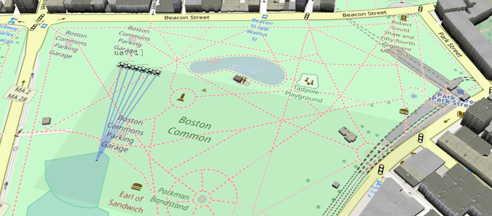

## multiUAV Simulation in OMNeT++

* Stationary, mobile and airborne nodes (UAVs,...)
* Charging stations
* Mission control
* MAVLink commands based flight planning
* Energy consumption simulation
* Energy maintenance operations
* Optimization
* Visualization

### Preparation

Boost is needed by this program. Please download here: http://www.boost.org/users/history/version_1_55_0.html
Copy the folder `boost` into the subdirectory `include-boost` of the OMNeT++ base directory.

Example Result: `C:\omnetpp-5.1.1\include-boost\boost\version.hpp`

### Running the simulation

#### Running in OMNeT++ IDE

In subdirectory `.\run_config` you can find predefined run and debug configuration ready to go with OMNeT++ IDE.

All launches are preconfigured to run the Gabelbach scenario.
* multiUAV-simulation cmdenv.launch ==> launches all runs without user interface (i.e. QTenv), that includes interating over all replacement modes and repeat for 10 times
* multiUAV-simulation cmdenv (0).launch ==> launches without user interface Run 0, i.e. replacement mode 0 and no repetition
* multiUAV-simulation debug.launch ==> launches the simulation with user interface, with debug information (should be run as debug) and Run 0
* multiUAV-simulation release.launch ==> launches the simulation with user interface in release state and Run 0

### Results

Results for Gabelbach szenario will be placed in subdirectory `.\results`. Depending on your launch configuration, you will find a different amount of output files. However, for each successfully finished simulation run, there should be following files:
- \*.elog: Eventlog
- \*.out: everything written to the ouput console
- \*.sca: scalar results that include the final results inclduing the six main figures:
  - utilizationEnergyOverdrawMaintenance
  - utilizationEnergyOverdrawMission
  - utilizationEnergyMaintenance
  - utilizationEnergyMission
  - utilizationSecMaintenance
  - utilizationSecMission
